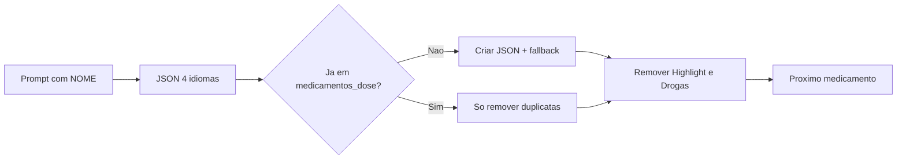

# Workflow: Template para medicamentos (aba Cálculos)

Este documento descreve o fluxo para gerar conteúdo de medicamentos para a aba **Cálculos** e evitar duplicidade com as abas Highlight (Dose Rápida) e Drogas.

- **Template de prompt:** [PROMPT_MEDICAMENTOS.md](../PROMPT_MEDICAMENTOS.md)
- **Regra Cursor (checklist e remoção):** `.cursor/rules/medicamentos-aba-calculos.mdc`

## Como executar este workflow

Para um **medicamento específico**, use o **nome** (ex.: Adrenalina, Salina 7,5%) e o **id** em snake_case (ex.: `adrenalina`, `salina_7_5`).

1. **Cenário A (novo):** Gerar JSON com o PROMPT de PROMPT_MEDICAMENTOS.md (substituir `[NOME DO MEDICAMENTO]` e `[id]`) → salvar em `assets/medicamentos_dose/[id].json` → adicionar ao `_medicamentosDoseFallback` em ordem alfabética → remover da Dose Rápida e da Drogas (secções 4.1 e 4.2).
2. **Cenário B (já existe em medicamentos_dose):** Não alterar JSON; apenas remover da Dose Rápida e da Drogas onde existir; pedir ao usuário para chamar o próximo medicamento.

Bulário (página 3): usar ou criar `assets/medicamentos/[id].json` separadamente; não é gerado pelo template.

---

## Visão geral do fluxo

- **ID do medicamento:** snake_case consistente (ex.: `adrenalina`, `sulfato_magnesio`). Usado em `assets/medicamentos_dose/[id].json` e `assets/medicamentos/[id].json`.

- **Página 1:** Cálculos (indicacoes + slidersInfusao).
- **Página 2:** Detalhes (classe, apresentacoes, preparo, observacoes, ajustesEspeciais).
- **Página 3:** Bulário — carregado de `assets/medicamentos/[id].json` (já existente ou a criar/melhorar).

---

## 1. Uso do template (geração do conteúdo)

1. Copiar o bloco PROMPT do arquivo [PROMPT_MEDICAMENTOS.md](../PROMPT_MEDICAMENTOS.md).
2. Substituir `[NOME DO MEDICAMENTO]` e `[id]` pelo nome de exibição e **ID em snake_case** (ex.: Adrenalina, `adrenalina`). O mesmo ID é usado em ambas as pastas de assets.
3. ID consistente:
   - Dose: `assets/medicamentos_dose/[id].json`
   - Bulário: `assets/medicamentos/[id].json`
4. Gerar JSON em 4 idiomas (PT, US, ES, ZH): `nome`, `pagina1`, `pagina2`, `vistaRapida`. Seguir padrão da Adrenalina e exemplo em `assets/medicamentos_dose/adrenalina.json`.

---

## 2. Onde salvar e como o app descobre

| O que | Onde |
|-------|------|
| JSON de dose (páginas 1 e 2 + vistaRapida) | `assets/medicamentos_dose/[id].json` |
| Bulário (página 3) | `assets/medicamentos/[id].json` (usar/melhorar o existente se houver) |
| Nome exibido no app | `lib/medicamento_unificado/medicamento_data.dart`: prioridade em `nome` por idioma; depois primeiro item de `vistaRapida`. |

- A lista da aba **Cálculos** é obtida via `AssetManifest` (todos os `.json` em `assets/medicamentos_dose/`). Novos arquivos na pasta são incluídos automaticamente (pubspec já declara a pasta).
- **Fallback:** Se o manifest falhar, a lista vem de `_medicamentosDoseFallback` em `lib/medicamento_unificado/medicamento_unificado_page.dart`. Ao adicionar um **novo** medicamento, incluir na lista fallback: `'assets/medicamentos_dose/[id].json',` em ordem alfabética (por nome do arquivo).

---

## 3. Checklist pós-geração

- JSON válido (ex.: jsonlint.com).
- 4 idiomas (PT, US, ES, ZH) com chave `nome` em cada um; **todas as páginas (pagina1, pagina2, vistaRapida) completas em cada idioma**.
- Indicacoes com `faixaEtaria`; infusões com `doseMin`/`doseMax` conforme tipo; sliders com adulto/pediátrico quando aplicável.
- `opcoesConcentracao` com diluições práticas; 6 observacoes; ajustes especiais como strings.
- `ajusteRenal`: string ("NAO" ou "ClCr <X: reduzir Y%"); `clCrThreshold` e `fatorAjusteRenal` só se houver ajuste numérico.
- Bulário: usar e, se necessário, melhorar o JSON em `assets/medicamentos/[id].json` para a página 3.
- Salvar em `assets/medicamentos_dose/[id].json`.
- **Remover** o medicamento da aba **Highlight (Dose Rápida)** e da aba **Drogas** (seção 4).

---

## 4. Remoção da Highlight (Dose Rápida) e da aba Drogas

Objetivo: evitar duplicidade quando o medicamento já está na aba Cálculos via `medicamentos_dose/[id].json`.

### 4.1 Remover da Dose Rápida (Highlight)

- **Onde:** Part files em `lib/doses_rapidas_page/`. A lista completa (usada em `_todasAsDoses()` / `_DoseData` em `lib/doses_rapidas_page.dart`) é: `analgesicos_iv_im.dart`, `analgesicos_vo.dart`, `anestesicos_locais.dart`, `anticoagulantes.dart`, `anticonvulsivantes.dart`, `antidotos.dart`, `antiemeticos_iv.dart`, `antiemeticos_vo.dart`, `antiarritmicos.dart`, `anti_hipertensivos.dart`, `antibioticos_iv.dart`, `antibioticos_vo.dart`, `benzodiazepinicos.dart`, `broncodilatadores.dart`, `corticoides.dart`, `diureticos.dart`, `drogas_emergencia.dart`, `gastroprotecao.dart`, `hemoderivados.dart`, `obstetricos.dart`, `opioides.dart`, `outros.dart`, `sedativos_antipsicoticos.dart`, `tromboliticos.dart`, `vasopressores_bolus.dart`, `vasopressores_infusao.dart`.
- **Ação:** Procurar por `_DoseRapidaItem` cujo campo **nome** corresponda ao medicamento (ex.: `nome: 'Adrenalina'`) e **remover o bloco inteiro** em cada arquivo onde aparecer (incluindo vírgula). Não é necessário alterar `_todasAsDoses()` em `lib/doses_rapidas_page.dart`.

### 4.2 Remover da aba Drogas

- **Lista de cards:** `lib/drogas_card/drogas.dart`
  - Em `_medicamentos`, localizar o(s) item(ns) cujo `'nome'` coincide com o medicamento (ex.: `MedicamentoAdrenalina.nome`).
  - Remover o(s) elemento(s) do array (o objeto `{ 'nome': ..., 'builder': ... }` inteiro).
  - Remover o **import** correspondente (ex.: `import 'vasopressores_hipotensores/adrenalina.dart' show MedicamentoAdrenalina;`).
- **Registry (navegação Dose Rápida → card):** `lib/drogas_card/medicamentos_registry.dart`
  - Remover todas as entradas de `medicamentosRegistry` que apontam para esse medicamento (incluindo aliases, ex.: `'adrenalina'` e `'epinefrina'`).
  - Remover o **import** do arquivo do card **somente se** esse card for exclusivo desse medicamento (ver caso especial abaixo).
- (Opcional) Excluir o arquivo do card em `lib/drogas_card/...`. Se outros arquivos importarem esse card, remover ou ajustar referências.

### 4.3 Caso especial – medicamento só com alias no registry (ex.: Insulina NPH)

Alguns medicamentos **não têm card próprio** na aba Drogas; existem apenas **aliases** no registry que apontam para outro card (ex.: "Insulina NPH" → card Insulina Regular). Nesse caso:

- **Dose Rápida:** remover o `_DoseRapidaItem` com o nome do medicamento (ex.: `nome: 'Insulina NPH'`) no(s) part file(s) em `lib/doses_rapidas_page/` (ex.: `outros.dart`).
- **Drogas:** remover **apenas** a(s) entrada(s) do registry para esse medicamento (ex.: `'insulina nph'`). **Não** remover o card compartilhado (ex.: Insulina Regular) nem o import do arquivo desse card em `drogas.dart` ou `medicamentos_registry.dart`, pois são usados por outros itens.

---

## 5. Dois cenários ao finalizar

**Cenário A – Medicamento novo (acabou de ser criado em medicamentos_dose):**

1. Garantir bulário em `assets/medicamentos/[id].json` (criar ou melhorar).
2. Salvar `assets/medicamentos_dose/[id].json`.
3. Adicionar entrada em `_medicamentosDoseFallback` em `lib/medicamento_unificado/medicamento_unificado_page.dart` em **ordem alfabética** (por nome do arquivo).
4. Remover o medicamento da Highlight e da Drogas (passos 4.1 e 4.2).
5. Seguir para o próximo medicamento quando quiser.

**Cenário B – Medicamento já existe em medicamentos_dose:**

1. Não criar nem alterar o JSON de dose.
2. Remover o medicamento da Highlight e da Drogas (passos 4.1 e 4.2), **se existir** nesses locais. Se não constar em nenhum dos dois, não há nada a remover.
3. Pedir ao usuário para chamar o próximo medicamento.

*Ex.: Concentrado de Hemácias já está em `medicamentos_dose` e não consta em Dose Rápida nem como card em Drogas; não há remoções, apenas chamar o próximo medicamento.*

---

## 6. Observações

- Antibióticos: incluir profilaxia cirúrgica nas indicações quando houver.
- Fontes sugeridas: Miller, Stoelting, ACLS/PALS, UpToDate, Micromedex.

---

## 7. Resumo dos arquivos envolvidos

| Ação | Arquivo(s) |
|------|------------|
| Salvar JSON de dose | `assets/medicamentos_dose/[id].json` |
| Bulário (página 3) | `assets/medicamentos/[id].json` (usar/melhorar) |
| Fallback lista Cálculos | `lib/medicamento_unificado/medicamento_unificado_page.dart` — `_medicamentosDoseFallback` |
| Nome exibido (leitura) | `lib/medicamento_unificado/medicamento_data.dart` — campo `nome` por idioma / `vistaRapida` |
| Remover Dose Rápida | Part files em `lib/doses_rapidas_page/` — remover `_DoseRapidaItem` com mesmo `nome` |
| Remover Drogas (lista + import) | `lib/drogas_card/drogas.dart` — `_medicamentos` e imports |
| Remover registry (e import) | `lib/drogas_card/medicamentos_registry.dart` — entradas e imports do card |
